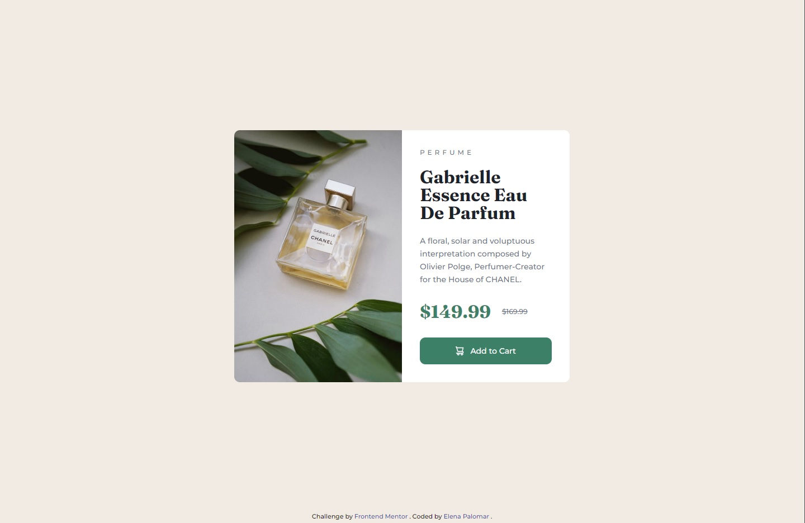

# Frontend Mentor - Product preview card component solution

## Welcome! 👋

Thanks for checking out this front-end coding challenge.

This is a solution to the [Product preview card component challenge on Frontend Mentor](https://www.frontendmentor.io/challenges/product-preview-card-component-GO7UmttRfa). Frontend Mentor challenges help you improve your coding skills by building realistic projects.

## Table of contents

- [Overview](#overview)
  - [Screenshot](#screenshot)
  - [Links](#links)
- [Built with](#built-with)
- [Useful resources](#useful-resources)
- [Author](#author)
- [Acknowledgments](#acknowledgments)

**Note: Delete this note and update the table of contents based on what sections you keep.**

## Overview

### Screenshot

  

### Links

- [Solution URL](https://github.com/ElenaPalomar/product-preview-card)
- [Live Site URL](https://elenapalomar.github.io/product-preview-card)

## Built with

- Semantic HTML5 markup
- CSS custom properties
- Flexbox
- Mobile-first workflow

## Useful resources

- [HTML <picture> Tag - w3schools](https://www.w3schools.com/tags/tag_picture.asp) - This helped me because the only way I knew how to change an image with media-queries was to use the image as background of a div. I think it makes more sense, semantically, to use the <picture> tag.
- [Uses for media-queries](https://web.dev/learn/design/media-queries/) - This is an amazing article which taught me some aspects about the media-queries that I didn´t know before reading it.

## Author

- Frontend Mentor - [@ElenaPalomar](https://www.frontendmentor.io/profile/ElenaPalomar)
- GitHub - [ElenaPalomar](https://github.com/search?q=ElenaPalomar)

## Acknowledgments

I want to thank to @correlucas, @gautamjuyal and @vcarames from the [Frontend Mentor](https://www.frontendmentor.io/home) community who taught me some important topics that made me improve my design.
